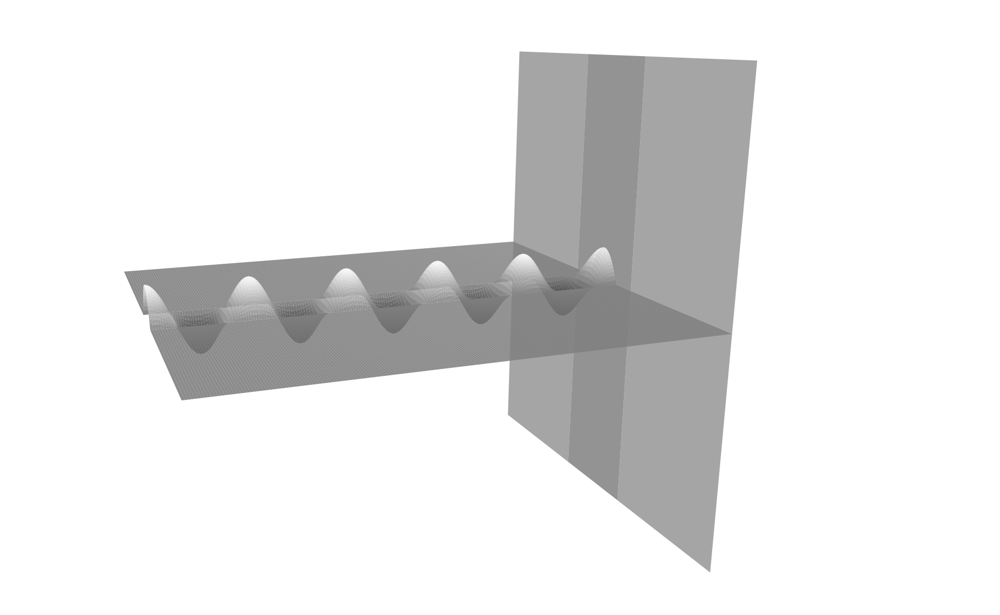
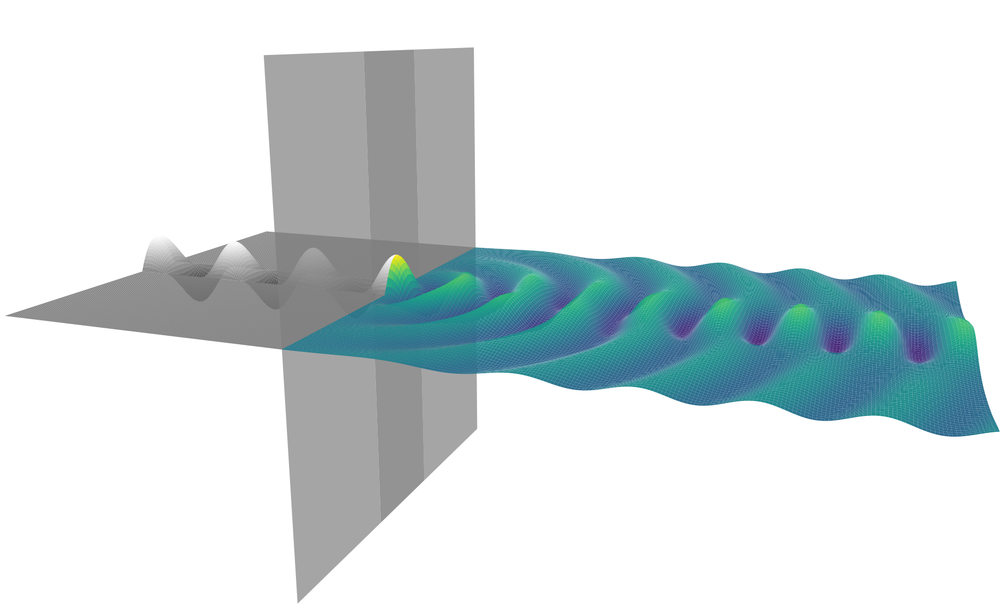
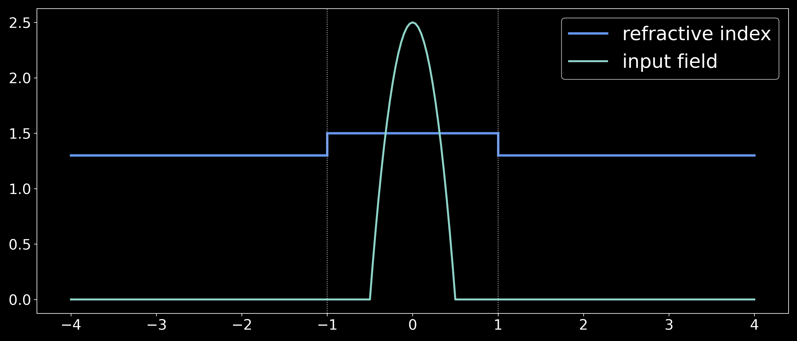

# slab

Calculates the fields in step-index slab waveguides with arbitrary numbers of layers.

## Synopsis

Below we see an input field, propagating in a vacuum, arriving at the endface of a 3 layer slab waveguide:

The slab package calculates the resultant field inside the guide:

It achieves this by calculating the guided and radiation modes of the structure, determining the guided mode weights, and integrating the radiation modes over the positive real numbers to find the radiation field.

<!-- The relevant refractive index and input field information can be provided more simply in the following plot:

 -->

